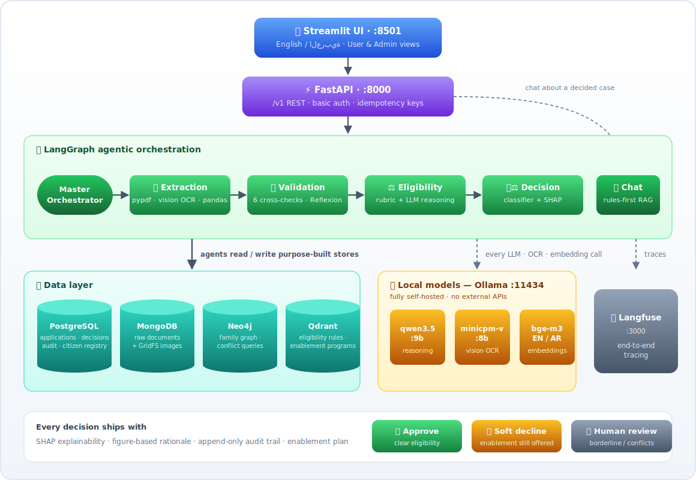
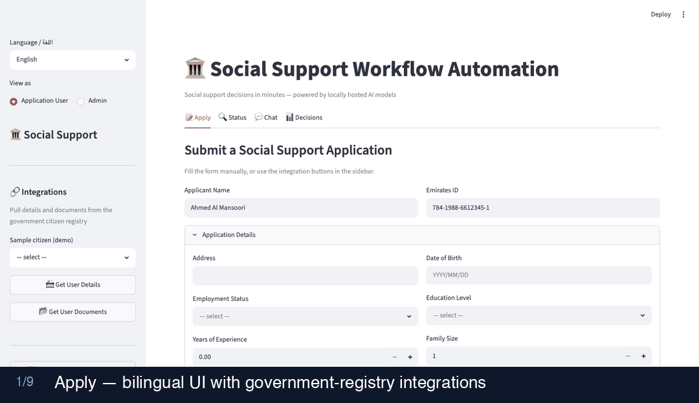
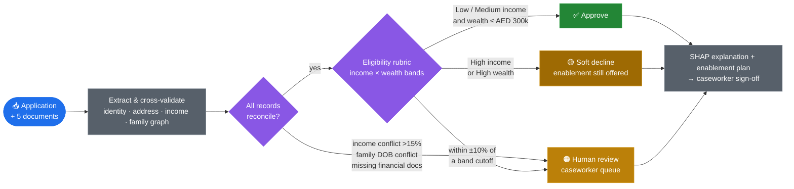

# 🏛️ Social Support Workflow Automation


An AI workflow for a government social security department that turns a **5–20 working day** application process into an explained decision **in ~25 seconds**.

<div align="center">
  <br/>
  <a href="https://www.youtube.com/watch?v=r1OXes8rub8">
    
  </a>
  <br/>
  <a href="https://www.youtube.com/watch?v=r1OXes8rub8"><b>▶️&nbsp; Watch the video demo on YouTube</b></a>
  <br/>
</div>

<div align="center">
  <br/>
  <a href="solution_summary.pdf">
    
  </a>
  &nbsp;
  <a href="solution_summary.docx">
    
  </a>
  <br/><br/>
</div>

<p align="center">
  <b>📑 Contents:</b>&nbsp;
  <a href="#%EF%B8%8F-user-interface">User Interface</a> ·
  <a href="#-installation">Installation</a> ·
  <a href="#-how-this-meets-the-evaluation-criteria">Evaluation Criteria</a> ·
  <a href="#-evaluation-metrics">Evaluation Metrics</a> ·
  <a href="#%EF%B8%8F-how-it-works">How It Works</a> ·
  <a href="#-documentation">Documentation</a>
</p>

An applicant (or caseworker) submits an application with five supporting documents — bank statement, credit report, Emirates ID, resume, assets/liabilities spreadsheet. Six LangGraph agents extract the data, cross-check it for inconsistencies, score eligibility with an explainable ML model, and return **approve**, **soft decline**, or **route to a human caseworker** — always with SHAP explainability and an economic-enablement plan (upskilling, job matching, or career counseling). Everything runs on locally hosted models: no applicant data ever leaves the machine.

<p align="center">
  
</p>

## 🖥️ User Interface

<p align="center">
  
</p>

---

## 🚀 Installation

**Prerequisites:** ~20 GB free disk · macOS ([Homebrew](https://brew.sh)), Linux, or Windows/WSL2. Docker and Ollama are installed automatically by setup.sh if missing (Docker Engine on Linux/WSL, colima on macOS — no Docker Desktop required).

```bash
git clone https://github.com/suvojith/social_support_automation
cd social_support_automation
bash setup.sh
```

That's the whole install. `setup.sh` detects your hardware, installs Docker and Ollama if needed, pulls the 3 models, starts ~10 containers, seeds all four databases, trains the classifier, and opens the UI — with per-step time estimates in the log (first run ~15–25 min, mostly model downloads; later runs ~1–2 min).

| Opens at | What |
|---|---|
| http://localhost:8501 | 🖥️ Streamlit UI (bilingual EN/AR, User/Admin views) |
| http://localhost:8000/docs | ⚡ API + Swagger docs |
| http://localhost:3000 | 🔍 Langfuse tracing |
| http://localhost:8080 | 🧠 OpenWebUI model playground |

**Try it in 3 clicks:** sidebar → pick a sample citizen → **📇 Get User Details** → **📂 Get User Documents** → **🚀 Submit**. Fifteen ready-made test profiles covering every decision path: [SAMPLE_DATA_GUIDE.md](SAMPLE_DATA_GUIDE.md).

---

## 🎯 How This Meets the Evaluation Criteria

### 1. Functionality — all of sections 2 & 3, built with the section-4 tools

**Every pain point in the problem statement is solved:**

| Pain point | Solution |
|---|---|
| Manual data gathering | Automated multimodal extraction — pypdf for PDFs, vision-LLM OCR (+Tesseract backstop) for the Emirates ID image, pandas for Excel — plus one-click profile & document pull from the citizen registry |
| Semi-automated validations | A validation agent runs 6 deterministic cross-checks (completeness, identity vs ID-card OCR, address, income >15% rule, employment vs resume, family DOB graph query) + an LLM Reflexion pass |
| Inconsistent information | Each named discrepancy explicitly detected: form-vs-bureau **address**, bank-vs-bureau **income**, conflicting **family details** via one-node-per-person Neo4j graph |
| Time-consuming reviews | One orchestrated pipeline replaces multi-department rounds: decision in ~25s; only the ~1% borderline/conflicted cases queue for a caseworker |
| Subjective decision-making | Fixed rubric + classifier (same input ⇒ same output), SHAP explanation per decision, demographic-parity check, no protected-class features, append-only audit trail, human sign-off framing |

**Solution scope delivered:** interactive form + all five named attachments ingested per data type · assessment on income level, employment history, family size, wealth, and (scoped) demographic profile · approve / **soft decline** recommendations (the case study's own wording) · enablement recommendations — upskilling, job matching, career counseling — via rules + RAG.

**Mandatory components:** ✅ locally hosted ML + LLM models (zero external APIs) · ✅ multimodal text/image/tabular processing **and** storage · ✅ interactive chat (caseworker-facing, grounded in the decision record) · ✅ agentic orchestration (LangGraph state machine).

**The exact technology stack requested:**

| Asked for | Used | How |
|---|---|---|
| Python | ✅ | Entire codebase |
| PostgreSQL | ✅ | Applications, decisions, append-only audit log, idempotency keys, citizen registry — [`src/storage/postgres.py`](src/storage/postgres.py) |
| MongoDB | ✅ | Raw documents, extracted JSON, GridFS images, registry document store — [`src/storage/mongo.py`](src/storage/mongo.py) |
| Qdrant (vector) | ✅ | Eligibility rules + enablement programs embedded with bge-m3; chat retrieves from it — [`src/storage/qdrant.py`](src/storage/qdrant.py) |
| Neo4j (graph) | ✅ | Family members as `Person` nodes per source document; Cypher query flags cross-document DOB conflicts — [`src/storage/neo4j.py`](src/storage/neo4j.py) |
| Scikit-learn classification | ✅ | GradientBoosting — right for small mixed-type tabular data + the explainability a government decision needs (SHAP, importances); logistic-regression baseline proves the choice — [`src/models/classifier.py`](src/models/classifier.py) |
| Tools per data type | ✅ | Text → pypdf · images → minicpm-v:8b OCR (+Tesseract) · tabular → pandas/openpyxl |
| GenAI agents (orchestrator, extraction, validation, eligibility, decision) | ✅ | Exactly those five + chat, one module each — [`src/agents/`](src/agents) |
| Reasoning framework (ReAct, Reflexion) | ✅ | ReAct tool use across agents; Reflexion self-critique in validation |
| Orchestration (LangGraph) | ✅ | Explicit state machine with conditional human-review routing — [`src/graph/workflow.py`](src/graph/workflow.py) |
| Model hosting (Ollama, OpenWebUI) | ✅ | Ollama serves all 3 models natively (Metal-accelerated); OpenWebUI at :8080 |
| Observability (Langfuse) | ✅ | Self-hosted v2 at :3000 traces every agent/LLM call |
| Serving (FastAPI) | ✅ | Versioned `/v1` API, idempotency keys, Swagger, optional auth at the proxy |
| Front-end (Streamlit) | ✅ | Bilingual UI with User/Admin roles at :8501 |
| Version control (GitHub) | ✅ | Public repo, incremental history, layered documentation |

### 2. Code quality
Modular packages with one responsibility each (`agents/`, `extraction/`, `storage/`, `governance/`, `models/`, `graph/`, `api/`, `ui/`) · typed Pydantic schemas and typed agent state · ruff-clean · 18 automated tests + E2E suite + evaluation harness · adding an agent = one node + one edge; adding a document type = one extractor.

### 3. Solution design
Auditable state-machine orchestration with an explicit human-review branch · honest ML (12% label noise so CV metrics are real; baseline comparison; SHAP on every decision) · each database chosen for its access pattern and justified across suitability/scalability/maintainability/performance/security in [`docs/solution_summary.md`](docs/solution_summary.md) · scale path documented (read replicas, sharding, bigger Qwen tiers — no code change).

### 4. Integration
All four databases participate in a single submission (PG record → Mongo docs → Neo4j family graph → Qdrant RAG) · **citizen-registry integration** shows the workflow living alongside existing government systems: `GET /v1/registry/{id}` prefills the form, `GET /v1/registry/{id}/documents` attaches the citizen's files · versioned API with payload-fingerprinted idempotency keys (same key + same payload = replay; same key + new payload = rejected 422).

### 5. Demo UI
3 clicks to a decision · decision card with confidence, rationale, SHAP chart · dashboard whose metrics always sum to the total · bilingual EN/AR · **User/Admin role switch** — Admin sees pipeline stage logs, audit trails, validation findings, LLM grounding context, response times, and a full Evaluation tab.

### 6. Problem-solving — real challenges met during development
| Challenge | Resolution |
|---|---|
| qwen3.5's Apple-Silicon build shipped without vision support | Pre-planned fallback executed: dedicated vision LLM (minicpm-v:8b) + Tesseract backstop |
| Thinking mode consumed the token budget → empty replies, ~2 min latency | Disabled per request → ~25s submissions, no empty responses |
| Deterministic rubric ⇒ classifier would memorize it (CV ≈ 1.0) | Injected 12% label noise → honest metrics + meaningful SHAP |
| OCR misread digits/names on small fonts; Arabic transliteration variants | Legible card rendering, exact-transcription prompt, fuzzy name matching |
| **LLM-as-judge caught an Ollama KV-cache bleed** — answers spliced facts from *other* applications when prompts shared long prefixes | Per-request reference token forces prompt divergence; judge scores went from 1/5 to 5/5 groundedness |
| Fairness check silently predicted on unscaled features (fake 0.0 disparity) | Caught by the evaluation harness; fixed → real slice rates now reported |

### 7. Communication
Layered docs for different readers: this README (run + evidence) → [SAMPLE_DATA_GUIDE.md](SAMPLE_DATA_GUIDE.md) (test it) → [solution summary](docs/solution_summary.md) (design depth) → Swagger (API) → tabulated [evaluation report](docs/evaluation_report.md).

---

## 📊 Evaluation Metrics

Three verification layers — unit/API tests, a live E2E suite, and an evaluation harness (`make eval`) that measures every stage against ground truth and writes [`docs/evaluation_report.md`](docs/evaluation_report.md). All of it is also visible in the UI's **Admin → Evaluation** tab.

**Eligibility classifier** — 5-fold stratified CV, 200 labeled applicants, 12% label noise:

| Metric | GradientBoosting | LogisticRegression baseline |
|---|---|---|
| F1 | **0.831 ± 0.033** | 0.790 |
| Accuracy | 0.805 ± 0.029 | 0.755 |
| Precision | 0.804 ± 0.033 | 0.762 |
| Recall | 0.866 ± 0.080 | 0.821 |
| ROC-AUC | 0.861 ± 0.055 | 0.829 |

**Document extraction accuracy** — every field vs registry ground truth, 15 citizens:

| Field (source) | Accuracy |
|---|---|
| Income, net worth, experience, education, family members (PDF/Excel parsing) | **100%** each |
| Emirates ID number / DOB / name (vision OCR) | 93% / 93% / 93% (fuzzy name ≥0.85) |

**End-to-end routing correctness** — expected vs actual outcome for all 15 registry citizens (7 approve, 4 soft decline, 4 human review): **15/15 (100%)**.

**Enablement RAG retrieval** — recall of available programs in top-3 per query intent: 67% / 100% / 100%.

**LLM-as-judge** (local qwen3.5, strict 1–5 rubric):

| What is judged | Criteria | Mean score |
|---|---|---|
| Chat answers (6 Q&As across 3 decided applications) | Groundedness / persona / completeness | **5.0** / 4.3 / **5.0** |
| Decision rationales (3 applications) | Consistency with the decision record | **5.0** |

**Fairness** — approval-rate parity across gender, age-band, and family-size slices; max disparity 22.6% on the synthetic set (reported, with per-slice rates, in the Admin Evaluation tab and [`docs/bias_report.json`](docs/bias_report.json)).

**Automated tests** — 18/18 passing (`make test`): rubric boundaries, enablement rules, extraction per document type, API smoke tests incl. idempotency replay & reuse-rejection. **E2E suite** — approve / soft-decline / human-review submissions through the live stack, idempotency check, chat, ~25s per decision ([`docs/e2e_test_report.txt`](docs/e2e_test_report.txt)).

---

## ⚙️ How It Works

Every submission flows through the same auditable path — cross-document checks first, eligibility second, and an explained recommendation (or a caseworker hand-off) at the end:



### The agents

| Agent | What it does | Techniques |
|---|---|---|
| **Orchestrator** (master) | Entry point; initializes shared typed state; fans out | LangGraph `StateGraph` |
| **Extraction** | Routes each document to its extractor; mirrors family members into Neo4j per source document | pypdf · minicpm-v OCR (+Tesseract) · pandas |
| **Validation** | 6 deterministic cross-checks (completeness, identity vs ID card, address, income >15%, employment vs resume, family-DOB Cypher query) + LLM self-critique | ReAct + **Reflexion** |
| **Eligibility** | Builds the 10-feature dictionary; applies the rubric (income band × wealth band, ±10% borderline zone) | Rubric + LLM reasoning |
| **Decision** | Combines rubric signal, validation flags, classifier probability → recommendation + SHAP; borderline/unresolvable → human review | GradientBoosting + SHAP |
| **Chat** | Caseworker-facing Q&A grounded in the persisted decision record; enablement via rules-first RAG | qwen3.5 + Qdrant retrieval |

### Decision logic
`per_capita_income` = min(bank, credit-report income) ÷ family size → **Low** (<3,000 AED) / **Medium** (3,000–8,000) / **High**; `net_worth` from the Excel → wealth bands. Low/Medium income **and** sub-High wealth ⇒ **approve**; either High ⇒ **soft decline** (still gets enablement — the department's dual mandate). Within ±10% of a cutoff, >15% income disagreement, missing financial evidence, or an unresolved cross-document conflict ⇒ **human review**. Outputs are recommendations for caseworker sign-off, never autonomous rulings.

### Local models (Ollama, native on the host — Metal-accelerated on Apple Silicon)

| Model | Size | Role |
|---|---|---|
| qwen3.5:9b-mlx | ~9 GB | All agent text reasoning + chat (thinking disabled for speed/reliability) |
| minicpm-v:8b | ~5.5 GB | Emirates ID image OCR (Tesseract in-image backstop) |
| bge-m3 | ~1.2 GB | Bilingual embeddings for Qdrant retrieval |

Models download to `~/.ollama/models`; containers reach the host daemon at `host.docker.internal:11434`. Prompts are centralized in [`src/config/prompts.py`](src/config/prompts.py) (EN + AR variants).

### Data stores

| Store | Holds | Why this store |
|---|---|---|
| PostgreSQL | Applications, decisions (+flags, SHAP), append-only audit, idempotency keys, citizen registry | ACID + referential integrity for records of legal consequence |
| MongoDB (+GridFS) | Raw documents, extracted JSON, images, registry document sets | Five attachment types, five shapes — schema-less absorbs the variety; PII masked before persistence |
| Qdrant | Embedded eligibility rules + enablement programs | Purpose-built vector search for RAG |
| Neo4j | Applicant→family `DECLARES` graph, one node per person per source document | Conflicting family details are a relationship query — one Cypher `WHERE size(dobs) > 1` |

### Citizen-registry integration
Simulates the workflow sitting beside existing government systems: `GET /v1/registry` (browse), `GET /v1/registry/{id}` (profile → form autofill), `GET /v1/registry/{id}/documents` (five documents → attachments). 15 seeded citizens cover every decision path — see [SAMPLE_DATA_GUIDE.md](SAMPLE_DATA_GUIDE.md).

### API

| Method | Endpoint | Purpose |
|---|---|---|
| POST | `/v1/apply` | Submit + run the workflow (idempotency-keyed, payload-fingerprinted) |
| GET | `/v1/status/{id}` · `/v1/decision/{id}` | Status · full decision with SHAP + validation flags |
| POST | `/v1/chat` | Case-review chat grounded in the decision record |
| GET | `/v1/applications` · `/v1/applications/stats` | Dashboard list · whole-table status counts |
| GET | `/v1/applications/{id}/audit` | Audit trail (admin diagnostics) |
| GET | `/v1/registry…` | Registry integration (above) |
| GET | `/v1/admin/metrics` | CV metrics, bias report, evaluation report |

Interactive docs at `/docs`; basic auth can be enabled at the Caddy proxy for gated deployments.

### UI — two roles
- **Application User**: the clean flow — form, autofill buttons, uploads, decision card, status, chat, dashboard.
- **Admin** (sidebar switch): everything above **plus** pipeline stage logs and timing during submission, per-application processing log (audit trail, validation findings, features, classifier output), the LLM grounding context and response times in chat, validation flags in the dashboard, and an **Evaluation tab** with classifier metrics, feature importances, fairness slices, and the full evaluation report.

### Security, privacy & fairness
Local-only models and self-hosted tracing (no applicant data leaves the machine) · PII masked before persistence · optional basic auth at the Caddy proxy for public URLs · append-only audit trail for appeals · no protected-class classifier inputs · demographic-parity check with published numbers · human-in-the-loop by design.

<details>
<summary><b>📁 Project layout · make commands · env vars</b></summary>

```
├── setup.sh              # one-command install + run (with step timings)
├── docker-compose.yml    # all services, local/cloud profiles
├── SAMPLE_DATA_GUIDE.md  # 15 test citizens + edge-case walkthroughs
├── src/
│   ├── agents/           # 6 LangGraph agents        ├── graph/     # state machine
│   ├── extraction/       # PDF / OCR / Excel         ├── models/    # classifier + SHAP
│   ├── storage/          # PG, Mongo, Qdrant, Neo4j  ├── governance/# PII, audit, bias
│   ├── api/              # FastAPI + auth            ├── ui/        # Streamlit (EN/AR)
│   └── config/           # settings + prompts
├── seeder/               # data, registry, KB, graph, classifier
├── tests/                # unit, API, OCR, E2E, evaluation harness
└── docs/                 # solution summary, reports, architecture
```

```bash
make up / down / logs      # run the stack
make seed                  # reseed data + retrain classifier
make test                  # 18 unit/API tests
make eval                  # evaluation harness → docs/evaluation_report.md
```

Key env vars (full list in [`.env.example`](.env.example)): `LLM_MODEL`, `VISION_MODEL`, `EMBED_MODEL`, `API_USERNAME`/`API_PASSWORD`, `N_SYNTHETIC_APPLICANTS`, `LABEL_NOISE_RATE`.

</details>

## 📚 Documentation

- 📖 [Solution Summary](solution_summary.pdf) (PDF, ≤10 pages · [Word](solution_summary.docx)) — architecture & data flow, five-dimension tool justification, modular workflow breakdown, future improvements & integration
- 🧪 [Sample Data Guide](SAMPLE_DATA_GUIDE.md) — the 15 registry citizens, expected outcomes, edge-case demos
- 📊 [Evaluation Report](docs/evaluation_report.md) · [CV Metrics](docs/cv_metrics.json) · [Bias Report](docs/bias_report.json) · [E2E Report](docs/e2e_test_report.txt)

## 📄 License

MIT
